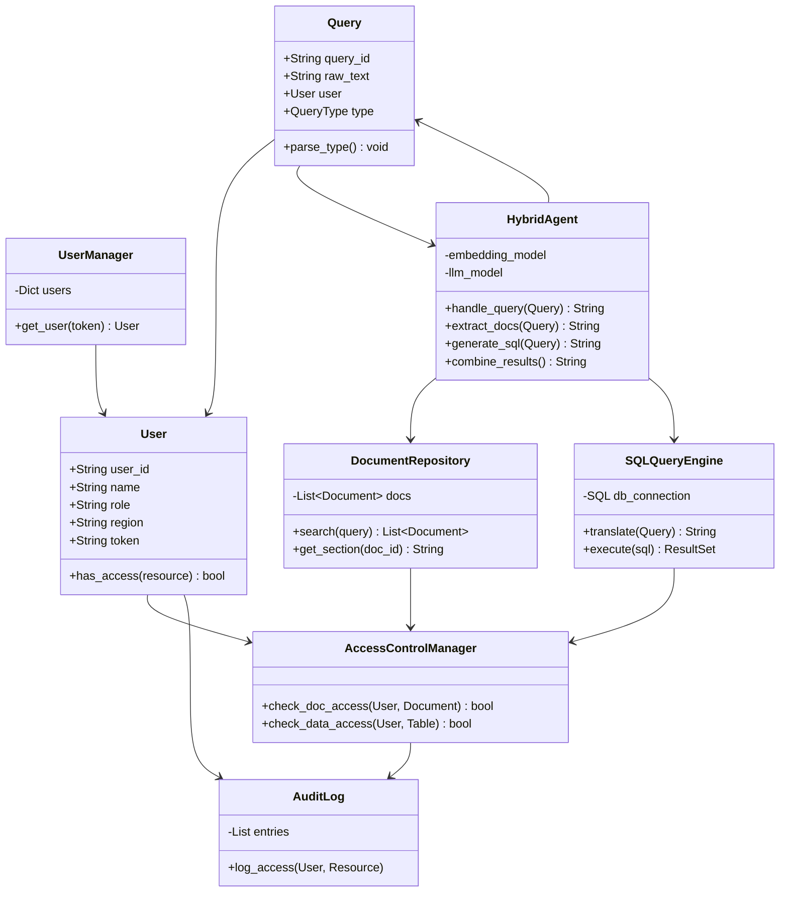

```mermaid
classDiagram
    class User {
        +String user_id
        +String name
        +String role
        +String region
        +String token
        +has_access(resource) bool
    }

    class UserManager {
        -Dict users
        +get_user(token) User
    }

    class Query {
        +String query_id
        +String raw_text
        +User user
        +QueryType type
        +parse_type() void
    }

    class HybridAgent {
        -embedding_model
        -llm_model
        +handle_query(Query) String
        +extract_docs(Query) String
        +generate_sql(Query) String
        +combine_results() String
    }

    class DocumentRepository {
        -List~Document~ docs
        +search(query) List~Document~
        +get_section(doc_id) String
    }

    class SQLQueryEngine {
        -SQL db_connection
        +translate(Query) String
        +execute(sql) ResultSet
    }

    class AccessControlManager {
        +check_doc_access(User, Document) bool
        +check_data_access(User, Table) bool
    }

    class AuditLog {
        -List entries
        +log_access(User, Resource)
    }

    UserManager --> User
    Query --> User
    HybridAgent --> Query
    HybridAgent --> DocumentRepository
    HybridAgent --> SQLQueryEngine
    Query --> HybridAgent
    DocumentRepository --> AccessControlManager
    SQLQueryEngine --> AccessControlManager
    User --> AccessControlManager
    User --> AuditLog
    AccessControlManager --> AuditLog
```